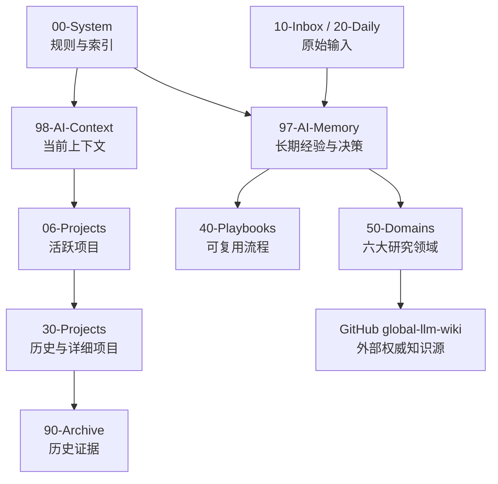
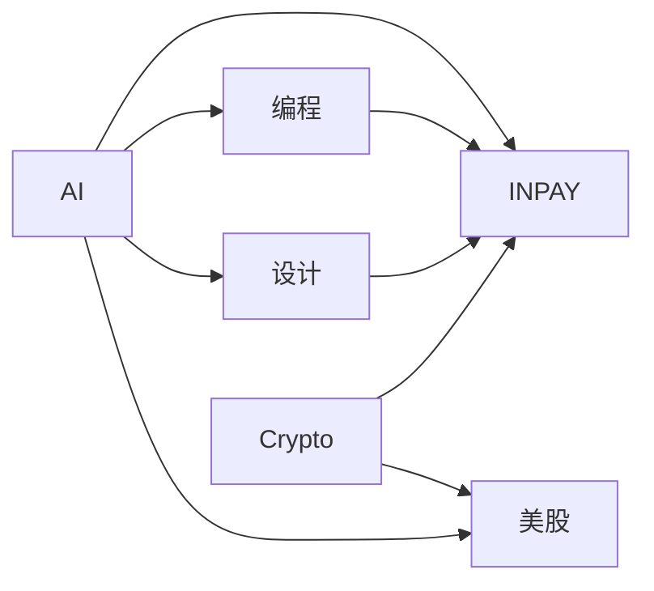

# 当前知识地图

## 领域关系

## 导航

- [[97-AI-Memory/README|长期记忆]]
- 当前上下文：仅保留在本机 Vault
- [[06-Projects/README|活跃项目]]
- [[00-System/HISTORY_CATALOG|历史目录]]
- [[50-Domains/README|研究领域]]
- [[40-Playbooks/README|可复用流程]]
